  <picture>
    <source media="(max-width: 760px) and (prefers-color-scheme: dark)" srcset="./assets/hero/kangajie-console-mobile-dark.svg">
    <source media="(max-width: 760px)" srcset="./assets/hero/kangajie-console-mobile-light.svg">
    <source media="(prefers-color-scheme: dark)" srcset="./assets/hero/kangajie-console-dark.svg">
    <source media="(prefers-color-scheme: light)" srcset="./assets/hero/kangajie-console-light.svg">
    
  </picture>

  

## About Me

I am **Kang Ajie**, a fullstack developer from Indonesia who enjoys building things end to end — from responsive frontends to backend APIs and mobile apps.

I like working across the whole stack: designing interfaces, wiring up servers, shaping databases, and shipping products that people can actually use. Right now I am sharpening my skills in modern web frameworks, exploring AI-powered applications, and experimenting with self-hosted infrastructure.

## Current Focus

| Area | What I am working on |
| --- | --- |
| **Web Development** | Fullstack apps with React, Next.js, TypeScript, and Laravel. |
| **AI Applications** | Building AI-powered assistants and integrating LLM APIs into real products. |
| **Mobile Development** | Cross-platform and native apps with Flutter and Kotlin. |
| **Infrastructure** | Self-hosted services, tunneling, and deployment on small devices like Raspberry Pi. |

## Featured Work

| Project | Focus | Why it matters |
| --- | --- | --- |
| [**KangAjie AI**](https://github.com/kangajie/kangajie-ai-frontend) | AI chat assistant | A personal AI assistant with a custom frontend and a TypeScript backend that integrates LLM APIs. [Backend](https://github.com/kangajie/kangajie-ai-backend) |
| [**KangAjieDev**](https://github.com/kangajie/kangajiedev) | Personal portfolio | My portfolio website showcasing projects, skills, and ways to get in touch. |
| [**Raspi Tunneling**](https://github.com/kangajie/tunneling-Raspi) | Self-hosted infrastructure | Exposing self-hosted services on a Raspberry Pi to the internet through secure tunneling. |

## Tech Stack

  
  
  
  
  
  
  
  
  
  
  
  
  

## GitHub Stats

  <picture>
    <source media="(prefers-color-scheme: dark)" srcset="./assets/stats/stats-dark.svg">
    <source media="(prefers-color-scheme: light)" srcset="./assets/stats/stats-light.svg">
    
  </picture>

## Contribution Raid

  <picture>
    <source media="(prefers-color-scheme: dark)" srcset="./assets/game/game-dark.svg">
    <source media="(prefers-color-scheme: light)" srcset="./assets/game/game-light.svg">
    
  </picture>

## Recent Activity

  <picture>
    <source media="(prefers-color-scheme: dark)" srcset="./assets/activity/activity-dark.svg">
    <source media="(prefers-color-scheme: light)" srcset="./assets/activity/activity-light.svg">
    
  </picture>

<!-- AUTO:ACTIVITY:START -->
- Jul 17, 2026: pushed 1 commit to [kangajie/kangajie](https://github.com/kangajie/kangajie).
- Jul 17, 2026: created a branch in [kangajie/kangajie](https://github.com/kangajie/kangajie).
- Jul 14, 2026: pushed 1 commit to [kangajie/kangajie-ai-frontend](https://github.com/kangajie/kangajie-ai-frontend).
- Jul 5, 2026: pushed 1 commit to [kangajie/kangajie-ai-frontend](https://github.com/kangajie/kangajie-ai-frontend).
- Jul 5, 2026: pushed 1 commit to [kangajie/kangajie-ai-backend](https://github.com/kangajie/kangajie-ai-backend).
- Jun 30, 2026: pushed 1 commit to [kangajie/kangajie-ai-frontend](https://github.com/kangajie/kangajie-ai-frontend).
<!-- AUTO:ACTIVITY:END -->

---

  Building across the stack — web, mobile, and everything in between.

